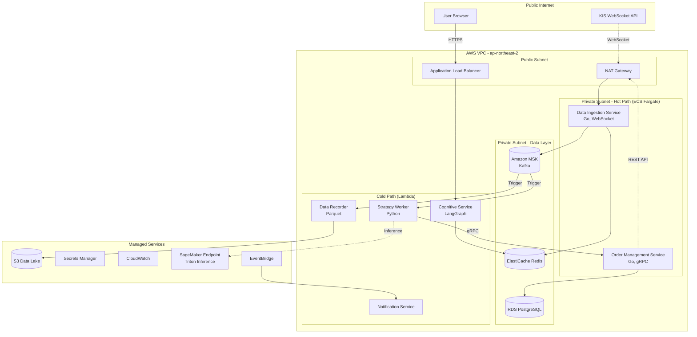

# AWS 기반 서버리스 아키텍처

> **AIPX 시스템의 클라우드 아키텍처 가이드**

---

## 📖 개요

AIPX는 **AWS 클라우드 네이티브 서비스**를 활용한 하이브리드 아키텍처로 구축됩니다. 핵심 원칙은 다음과 같습니다:

- **저지연 필수 컴포넌트** (Data Ingestion, OMS) → **ECS Fargate**
- **이벤트 기반 간헐적 실행** (Strategy Worker, Cognitive Service) → **Lambda**
- **데이터 레이어** → **관리형 서비스** (MSK, ElastiCache, RDS)

---

## 🏗️ 시스템 아키텍처



---

## 🚀 서비스 구성

### 1. Hot Path (ECS Fargate)

저지연이 필수인 컴포넌트는 **ECS Fargate**에 배포하여 콜드 스타트 없이 항상 실행 상태를 유지합니다.

#### Data Ingestion Service

**역할**: KIS WebSocket 연결 유지 및 실시간 데이터 수집

```hcl
# infrastructure/terraform/modules/hot-path/data-ingestion.tf
resource "aws_ecs_task_definition" "data_ingestion" {
  family                   = "data-ingestion"
  network_mode             = "awsvpc"
  requires_compatibilities = ["FARGATE"]
  cpu                      = "512"   # 0.5 vCPU
  memory                   = "1024"  # 1GB

  container_definitions = jsonencode([{
    name  = "ingestion"
    image = "${aws_ecr_repository.data_ingestion.repository_url}:latest"

    environment = [
      { name = "KAFKA_BROKERS", value = var.kafka_brokers },
      { name = "REDIS_HOST", value = var.redis_endpoint }
    ]

    secrets = [
      {
        name      = "KIS_APP_KEY"
        valueFrom = "${aws_secretsmanager_secret.kis_credentials.arn}:app_key::"
      },
      {
        name      = "KIS_APP_SECRET"
        valueFrom = "${aws_secretsmanager_secret.kis_credentials.arn}:app_secret::"
      }
    ]

    logConfiguration = {
      logDriver = "awslogs"
      options = {
        "awslogs-group"         = "/ecs/data-ingestion"
        "awslogs-region"        = "ap-northeast-2"
        "awslogs-stream-prefix" = "ecs"
      }
    }
  }])

  execution_role_arn = aws_iam_role.ecs_execution.arn
  task_role_arn      = aws_iam_role.data_ingestion_task.arn
}

resource "aws_ecs_service" "data_ingestion" {
  name            = "data-ingestion"
  cluster         = var.ecs_cluster_id
  task_definition = aws_ecs_task_definition.data_ingestion.arn
  desired_count   = 2
  launch_type     = "FARGATE"

  network_configuration {
    subnets          = var.private_subnet_ids
    security_groups  = [aws_security_group.ecs_tasks.id]
    assign_public_ip = false
  }
}
```

#### Order Management Service (OMS)

**역할**: gRPC 양방향 스트리밍으로 초저지연 주문 실행

```hcl
# infrastructure/terraform/modules/hot-path/oms.tf
resource "aws_ecs_task_definition" "oms" {
  family                   = "order-management-service"
  network_mode             = "awsvpc"
  requires_compatibilities = ["FARGATE"]
  cpu                      = "1024"  # 1 vCPU
  memory                   = "2048"  # 2GB

  container_definitions = jsonencode([{
    name  = "oms"
    image = "${aws_ecr_repository.oms.repository_url}:latest"

    portMappings = [{
      containerPort = 50051
      protocol      = "tcp"
    }]

    environment = [
      { name = "REDIS_HOST", value = var.redis_endpoint },
      { name = "DB_HOST", value = var.database_endpoint }
    ]

    healthCheck = {
      command = ["CMD-SHELL", "grpc_health_probe -addr=:50051"]
      interval = 30
      timeout  = 5
      retries  = 3
    }

    logConfiguration = {
      logDriver = "awslogs"
      options = {
        "awslogs-group"         = "/ecs/oms"
        "awslogs-region"        = "ap-northeast-2"
        "awslogs-stream-prefix" = "ecs"
      }
    }
  }])

  execution_role_arn = aws_iam_role.ecs_execution.arn
  task_role_arn      = aws_iam_role.oms_task.arn
}

resource "aws_ecs_service" "oms" {
  name            = "oms"
  cluster         = var.ecs_cluster_id
  task_definition = aws_ecs_task_definition.oms.arn
  desired_count   = 3
  launch_type     = "FARGATE"

  network_configuration {
    subnets          = var.private_subnet_ids
    security_groups  = [aws_security_group.ecs_tasks.id]
    assign_public_ip = false
  }

  load_balancer {
    target_group_arn = aws_lb_target_group.oms_grpc.arn
    container_name   = "oms"
    container_port   = 50051
  }

  service_registries {
    registry_arn = aws_service_discovery_service.oms.arn
  }
}

# Internal NLB for gRPC
resource "aws_lb" "oms_internal" {
  name               = "oms-internal-nlb"
  internal           = true
  load_balancer_type = "network"
  subnets            = var.private_subnet_ids
}

resource "aws_lb_target_group" "oms_grpc" {
  name        = "oms-grpc"
  port        = 50051
  protocol    = "TCP"
  target_type = "ip"
  vpc_id      = var.vpc_id

  health_check {
    protocol = "TCP"
    port     = 50051
  }
}
```

---

### 2. Cold Path (Lambda)

이벤트 기반 간헐적 실행 컴포넌트는 **Lambda**로 배포하여 비용을 최적화합니다.

#### Strategy Worker

**역할**: Kafka 메시지 수신 → 전략 실행 → OMS 주문 전송

```python
# services/strategy-worker/lambda/handler.py
import os
import json
import grpc
from proto import order_service_pb2, order_service_pb2_grpc
from strategy import load_strategy

def lambda_handler(event, context):
    """
    MSK 트리거로 Kafka 메시지 배치 수신

    event: {
        "eventSource": "aws:kafka",
        "records": {
            "market.tick-0": [
                {
                    "topic": "market.tick",
                    "partition": 0,
                    "offset": 12345,
                    "timestamp": 1234567890,
                    "key": "삼성전자",
                    "value": "base64-encoded-protobuf"
                }
            ]
        }
    }
    """

    orders = []

    for topic_partition, messages in event['records'].items():
        for msg in messages:
            # Protobuf 디코딩
            tick_data = decode_tick_data(msg['value'])

            # 전략 실행
            strategy = load_strategy(context.function_name)
            signal = strategy.on_tick(tick_data)

            if signal:
                orders.append(signal)

    # OMS로 주문 전송 (gRPC)
    if orders:
        send_orders_to_oms(orders)

    return {
        'statusCode': 200,
        'body': json.dumps(f'Processed {len(orders)} orders')
    }

def send_orders_to_oms(orders):
    """gRPC를 통한 OMS 주문 전송"""
    oms_endpoint = os.getenv('OMS_ENDPOINT')

    with grpc.insecure_channel(oms_endpoint) as channel:
        stub = order_service_pb2_grpc.OrderServiceStub(channel)

        for order in orders:
            request = order_service_pb2.OrderRequest(
                symbol=order['symbol'],
                side=order['side'],
                quantity=order['quantity'],
                price=order['price']
            )

            response = stub.SendOrder(request)
            print(f"Order response: {response.status}")
```

```hcl
# infrastructure/terraform/modules/cold-path/strategy-worker.tf
resource "aws_lambda_function" "strategy_worker" {
  function_name = "strategy-worker"
  role          = aws_iam_role.lambda_exec.arn

  # 컨테이너 이미지 (gRPC, Protobuf 포함)
  package_type = "Image"
  image_uri    = "${var.ecr_repository_url}:latest"

  memory_size = 2048
  timeout     = 300  # 5분

  environment {
    variables = {
      OMS_ENDPOINT = var.oms_endpoint
      REDIS_HOST   = var.redis_endpoint
    }
  }

  vpc_config {
    subnet_ids         = var.private_subnet_ids
    security_group_ids = [aws_security_group.lambda.id]
  }
}

# MSK 트리거
resource "aws_lambda_event_source_mapping" "kafka_trigger" {
  event_source_arn  = var.msk_cluster_arn
  function_name     = aws_lambda_function.strategy_worker.arn
  topics            = ["market.tick"]
  starting_position = "LATEST"

  batch_size                         = 100
  maximum_batching_window_in_seconds = 5
}
```

#### Cognitive Service

**역할**: LangGraph 에이전트 실행, API Gateway WebSocket

```python
# services/cognitive-service/lambda/handler.py
import json
import boto3
from langchain_anthropic import ChatAnthropic
from langgraph.graph import StateGraph

dynamodb = boto3.resource('dynamodb')
table = dynamodb.Table('conversation-states')

def lambda_handler(event, context):
    """
    API Gateway WebSocket 요청 처리
    """
    connection_id = event['requestContext']['connectionId']
    route_key = event['requestContext']['routeKey']

    if route_key == '$connect':
        return {'statusCode': 200}

    if route_key == '$disconnect':
        # 상태 정리
        table.delete_item(Key={'connection_id': connection_id})
        return {'statusCode': 200}

    # 메시지 처리
    body = json.loads(event.get('body', '{}'))

    # 상태 로드
    response = table.get_item(Key={'connection_id': connection_id})
    state = response.get('Item', {}).get('state', {})

    # LangGraph 워크플로우 실행
    workflow = create_workflow()
    result = workflow.invoke({
        "messages": state.get("messages", []) + [body['message']]
    })

    # 상태 저장
    table.put_item(Item={
        'connection_id': connection_id,
        'state': result
    })

    # WebSocket 응답
    send_to_websocket(connection_id, {
        "message": result["messages"][-1],
        "profile_complete": result.get("profile_complete", False)
    })

    return {'statusCode': 200}

def send_to_websocket(connection_id, data):
    """API Gateway Management API로 메시지 전송"""
    client = boto3.client('apigatewaymanagementapi',
        endpoint_url=f"https://{os.getenv('WEBSOCKET_API_ID')}.execute-api.ap-northeast-2.amazonaws.com/production"
    )

    client.post_to_connection(
        ConnectionId=connection_id,
        Data=json.dumps(data).encode('utf-8')
    )

def create_workflow():
    """LangGraph 워크플로우 생성"""
    llm = ChatAnthropic(model="claude-3-5-sonnet-20241022")

    workflow = StateGraph(AgentState)
    workflow.add_node("profile_agent", profile_agent)
    workflow.add_node("strategy_architect", strategy_architect)
    workflow.set_entry_point("profile_agent")

    return workflow.compile()
```

```hcl
# infrastructure/terraform/modules/cold-path/cognitive-service.tf
resource "aws_lambda_function" "cognitive" {
  function_name = "cognitive-service"
  role          = aws_iam_role.lambda_exec.arn

  package_type = "Image"
  image_uri    = "${var.ecr_repository_url}:latest"

  memory_size = 3008  # LangGraph 메모리 요구사항
  timeout     = 60

  environment {
    variables = {
      ANTHROPIC_API_KEY = data.aws_secretsmanager_secret_version.anthropic.secret_string
      DYNAMODB_TABLE    = aws_dynamodb_table.conversation_states.name
      WEBSOCKET_API_ID  = aws_apigatewayv2_api.websocket.id
    }
  }

  vpc_config {
    subnet_ids         = var.private_subnet_ids
    security_group_ids = [aws_security_group.lambda.id]
  }
}

# API Gateway WebSocket
resource "aws_apigatewayv2_api" "websocket" {
  name                       = "aipx-websocket"
  protocol_type              = "WEBSOCKET"
  route_selection_expression = "$request.body.action"
}

resource "aws_apigatewayv2_integration" "cognitive" {
  api_id           = aws_apigatewayv2_api.websocket.id
  integration_type = "AWS_PROXY"
  integration_uri  = aws_lambda_function.cognitive.invoke_arn
}

resource "aws_apigatewayv2_route" "default" {
  api_id    = aws_apigatewayv2_api.websocket.id
  route_key = "$default"
  target    = "integrations/${aws_apigatewayv2_integration.cognitive.id}"
}

resource "aws_apigatewayv2_route" "connect" {
  api_id    = aws_apigatewayv2_api.websocket.id
  route_key = "$connect"
  target    = "integrations/${aws_apigatewayv2_integration.cognitive.id}"
}

resource "aws_apigatewayv2_route" "disconnect" {
  api_id    = aws_apigatewayv2_api.websocket.id
  route_key = "$disconnect"
  target    = "integrations/${aws_apigatewayv2_integration.cognitive.id}"
}

# DynamoDB for conversation state
resource "aws_dynamodb_table" "conversation_states" {
  name         = "conversation-states"
  billing_mode = "PAY_PER_REQUEST"
  hash_key     = "connection_id"

  attribute {
    name = "connection_id"
    type = "S"
  }

  ttl {
    enabled        = true
    attribute_name = "ttl"
  }
}
```

#### Notification Service

**역할**: EventBridge 트리거로 알림 전송

```python
# services/notification-service/lambda/handler.py
import os
import boto3
from slack_sdk import WebClient

slack = WebClient(token=os.getenv('SLACK_TOKEN'))
sns = boto3.client('sns')

def lambda_handler(event, context):
    """
    EventBridge 이벤트 수신

    event: {
        "detail-type": "OrderFilled",
        "detail": {
            "symbol": "삼성전자",
            "side": "BUY",
            "price": 70000,
            "quantity": 10
        }
    }
    """

    detail = event['detail']

    # Slack 알림
    slack.chat_postMessage(
        channel='#trading-alerts',
        text=f"✅ 체결 완료: {detail['symbol']} {detail['side']} {detail['quantity']}주 @ {detail['price']:,}원"
    )

    # SMS 알림 (선택)
    if os.getenv('SMS_ENABLED') == 'true':
        sns.publish(
            PhoneNumber='+821012345678',
            Message=f"체결: {detail['symbol']} {detail['quantity']}주"
        )

    return {'statusCode': 200}
```

```hcl
# infrastructure/terraform/modules/cold-path/notification.tf
resource "aws_lambda_function" "notification" {
  function_name = "notification-service"
  role          = aws_iam_role.lambda_exec.arn

  filename      = "notification.zip"
  handler       = "handler.lambda_handler"
  runtime       = "python3.11"
  memory_size   = 512
  timeout       = 30

  environment {
    variables = {
      SLACK_TOKEN  = data.aws_secretsmanager_secret_version.slack.secret_string
      SMS_ENABLED  = "true"
    }
  }
}

# EventBridge Rule
resource "aws_cloudwatch_event_rule" "order_filled" {
  name        = "order-filled"
  description = "주문 체결 이벤트"

  event_pattern = jsonencode({
    "detail-type": ["OrderFilled"],
    "source": ["aipx.oms"]
  })
}

resource "aws_cloudwatch_event_target" "notification" {
  rule      = aws_cloudwatch_event_rule.order_filled.name
  target_id = "notification-lambda"
  arn       = aws_lambda_function.notification.arn
}

resource "aws_lambda_permission" "allow_eventbridge" {
  statement_id  = "AllowExecutionFromEventBridge"
  action        = "lambda:InvokeFunction"
  function_name = aws_lambda_function.notification.function_name
  principal     = "events.amazonaws.com"
  source_arn    = aws_cloudwatch_event_rule.order_filled.arn
}
```

#### Data Recorder

**역할**: Kafka → Parquet → S3 저장

```python
# services/data-recorder-service/lambda/handler.py
import boto3
from io import BytesIO
import pyarrow as pa
import pyarrow.parquet as pq
from datetime import datetime

s3 = boto3.client('s3')

def lambda_handler(event, context):
    """
    MSK 메시지 배치를 Parquet로 변환하여 S3에 저장
    """

    records = []
    for topic_partition, messages in event['records'].items():
        for msg in messages:
            tick_data = decode_tick_data(msg['value'])
            records.append({
                'symbol': tick_data.symbol,
                'price': tick_data.price,
                'volume': tick_data.volume,
                'timestamp': tick_data.timestamp
            })

    # Parquet 변환
    table = pa.Table.from_pylist(records)
    buf = BytesIO()
    pq.write_table(table, buf, compression='snappy')

    # S3 업로드 (시간 기반 파티셔닝)
    now = datetime.now()
    key = f"raw/market-data/year={now.year}/month={now.month:02d}/day={now.day:02d}/{context.request_id}.parquet"

    s3.put_object(
        Bucket='aipx-data-lake',
        Key=key,
        Body=buf.getvalue()
    )

    return {
        'statusCode': 200,
        'records_saved': len(records)
    }
```

---

### 3. Data Layer

#### Amazon MSK (Kafka)

```hcl
# infrastructure/terraform/modules/data-layer/kafka.tf
resource "aws_msk_cluster" "aipx" {
  cluster_name           = "aipx-kafka"
  kafka_version          = "3.5.1"
  number_of_broker_nodes = 3

  broker_node_group_info {
    instance_type   = "kafka.m5.large"
    client_subnets  = var.private_subnet_ids
    security_groups = [aws_security_group.kafka.id]

    storage_info {
      ebs_storage_info {
        volume_size = 100
      }
    }
  }

  configuration_info {
    arn      = aws_msk_configuration.aipx.arn
    revision = aws_msk_configuration.aipx.latest_revision
  }

  encryption_info {
    encryption_at_rest_kms_key_arn = aws_kms_key.kafka.arn
  }

  logging_info {
    broker_logs {
      cloudwatch_logs {
        enabled   = true
        log_group = aws_cloudwatch_log_group.kafka.name
      }
    }
  }
}

resource "aws_msk_configuration" "aipx" {
  name              = "aipx-config"
  kafka_versions    = ["3.5.1"]

  server_properties = <<PROPERTIES
auto.create.topics.enable=true
default.replication.factor=3
min.insync.replicas=2
num.partitions=10
log.retention.hours=168
PROPERTIES
}
```

#### ElastiCache Redis

```hcl
# infrastructure/terraform/modules/data-layer/redis.tf
resource "aws_elasticache_replication_group" "aipx" {
  replication_group_id       = "aipx-redis"
  replication_group_description = "AIPX Redis Cluster"
  engine                     = "redis"
  engine_version             = "7.0"
  node_type                  = "cache.r6g.large"
  number_cache_clusters      = 6  # 3 shards × 2 (primary + replica)

  automatic_failover_enabled = true
  multi_az_enabled          = true
  at_rest_encryption_enabled = true
  transit_encryption_enabled = true

  subnet_group_name = aws_elasticache_subnet_group.aipx.name
  security_group_ids = [aws_security_group.redis.id]

  snapshot_retention_limit = 5
  snapshot_window         = "03:00-05:00"

  parameter_group_name = aws_elasticache_parameter_group.aipx.name
}

resource "aws_elasticache_parameter_group" "aipx" {
  name   = "aipx-redis7"
  family = "redis7"

  parameter {
    name  = "maxmemory-policy"
    value = "allkeys-lru"
  }
}
```

#### RDS PostgreSQL

```hcl
# infrastructure/terraform/modules/data-layer/database.tf
resource "aws_db_instance" "aipx" {
  identifier     = "aipx-postgres"
  engine         = "postgres"
  engine_version = "15.4"
  instance_class = "db.r6g.xlarge"

  allocated_storage     = 100
  max_allocated_storage = 1000
  storage_type         = "gp3"
  storage_encrypted    = true

  db_name  = "aipx"
  username = "aipx_admin"
  password = random_password.db_password.result

  multi_az               = true
  publicly_accessible    = false
  vpc_security_group_ids = [aws_security_group.rds.id]
  db_subnet_group_name   = aws_db_subnet_group.aipx.name

  backup_retention_period = 7
  backup_window          = "03:00-04:00"
  maintenance_window     = "sun:04:00-sun:05:00"

  enabled_cloudwatch_logs_exports = ["postgresql", "upgrade"]
  performance_insights_enabled    = true

  tags = {
    Name = "AIPX PostgreSQL"
  }
}

# TimescaleDB Extension
resource "null_resource" "enable_timescaledb" {
  provisioner "local-exec" {
    command = <<EOF
psql -h ${aws_db_instance.aipx.address} -U aipx_admin -d aipx -c "CREATE EXTENSION IF NOT EXISTS timescaledb CASCADE;"
EOF
  }
}
```

#### S3 Data Lake

```hcl
# infrastructure/terraform/modules/data-layer/storage.tf
resource "aws_s3_bucket" "data_lake" {
  bucket = "aipx-data-lake"
}

resource "aws_s3_bucket_versioning" "data_lake" {
  bucket = aws_s3_bucket.data_lake.id

  versioning_configuration {
    status = "Enabled"
  }
}

resource "aws_s3_bucket_lifecycle_configuration" "data_lake" {
  bucket = aws_s3_bucket.data_lake.id

  rule {
    id     = "archive-old-data"
    status = "Enabled"

    transition {
      days          = 90
      storage_class = "GLACIER"
    }

    transition {
      days          = 365
      storage_class = "DEEP_ARCHIVE"
    }
  }
}

resource "aws_s3_bucket_intelligent_tiering_configuration" "data_lake" {
  bucket = aws_s3_bucket.data_lake.id
  name   = "EntireBucket"

  tiering {
    access_tier = "ARCHIVE_ACCESS"
    days        = 90
  }
}
```

---

## 💰 비용 분석

### 월별 예상 비용 (서울 리전 기준)

| 서비스 | 사양 | 월 비용 (USD) |
|:---|:---|---:|
| **Hot Path (ECS Fargate)** | | |
| Data Ingestion | 0.5 vCPU × 2 task | ~$60 |
| OMS | 1 vCPU × 3 task | ~$180 |
| **Cold Path (Lambda)** | | |
| Strategy Worker | 1000만 실행 × 2GB × 5초 | ~$100 |
| Cognitive Service | 10만 실행 × 3GB × 30초 | ~$50 |
| Notification | 100만 실행 × 512MB × 1초 | ~$10 |
| Data Recorder | 500만 실행 × 1GB × 3초 | ~$30 |
| **Data Layer** | | |
| MSK | kafka.m5.large × 3 | ~$700 |
| ElastiCache | cache.r6g.large × 6 | ~$700 |
| RDS PostgreSQL | db.r6g.xlarge (Multi-AZ) | ~$650 |
| S3 | 1TB 저장 + 요청 | ~$30 |
| **Network** | | |
| NAT Gateway | 2개 (Multi-AZ) | ~$70 |
| ALB | - | ~$25 |
| **Monitoring & Etc** | | |
| CloudWatch | 로그 + 메트릭 | ~$50 |
| **월 총합** | | **~$2,655** |

### 비용 최적화 전략

#### 1. 개발 환경 (~$800/월)

```hcl
# infrastructure/terraform/environments/dev/aws.tfvars
environment = "dev"

# ECS Fargate 최소 스펙
ingestion_cpu    = 256
ingestion_memory = 512
oms_cpu          = 512
oms_memory       = 1024

# MSK 작은 인스턴스
kafka_instance_type = "kafka.t3.small"
kafka_broker_count  = 1

# ElastiCache 최소
redis_node_type = "cache.t3.micro"
redis_num_nodes = 1

# RDS 최소
database_instance_class = "db.t3.micro"
database_multi_az       = false
```

#### 2. 프로덕션 환경 최적화 (~$1,500-1,800/월)

- **Savings Plans**: Lambda/Fargate 1년 약정 → 17% 할인
- **Reserved Instances**: RDS, ElastiCache 1년 → 40% 할인
- **Spot Instances**: 개발/테스트 환경 ECS 노드 → 70% 할인
- **S3 Intelligent-Tiering**: 자동 아카이빙
- **Lambda 메모리 최적화**: AWS Compute Optimizer 권장사항 적용

---

## 🔒 보안 아키텍처

### VPC 구성

```hcl
# infrastructure/terraform/modules/network/vpc.tf
resource "aws_vpc" "aipx" {
  cidr_block           = "10.0.0.0/16"
  enable_dns_hostnames = true
  enable_dns_support   = true

  tags = {
    Name = "aipx-vpc"
  }
}

# Public Subnet (ALB, NAT Gateway)
resource "aws_subnet" "public" {
  count             = 2
  vpc_id            = aws_vpc.aipx.id
  cidr_block        = cidrsubnet(aws_vpc.aipx.cidr_block, 8, count.index)
  availability_zone = data.aws_availability_zones.available.names[count.index]

  map_public_ip_on_launch = true

  tags = {
    Name = "aipx-public-${count.index + 1}"
  }
}

# Private Subnet (ECS, Lambda, RDS, MSK)
resource "aws_subnet" "private" {
  count             = 2
  vpc_id            = aws_vpc.aipx.id
  cidr_block        = cidrsubnet(aws_vpc.aipx.cidr_block, 8, count.index + 10)
  availability_zone = data.aws_availability_zones.available.names[count.index]

  tags = {
    Name = "aipx-private-${count.index + 1}"
  }
}
```

### Security Groups

```hcl
# ECS Tasks
resource "aws_security_group" "ecs_tasks" {
  name        = "aipx-ecs-tasks"
  description = "Security group for ECS tasks"
  vpc_id      = aws_vpc.aipx.id

  egress {
    from_port   = 0
    to_port     = 0
    protocol    = "-1"
    cidr_blocks = ["0.0.0.0/0"]
  }
}

# RDS
resource "aws_security_group_rule" "ecs_to_rds" {
  type                     = "ingress"
  from_port                = 5432
  to_port                  = 5432
  protocol                 = "tcp"
  source_security_group_id = aws_security_group.ecs_tasks.id
  security_group_id        = aws_security_group.rds.id
}

# Lambda
resource "aws_security_group" "lambda" {
  name        = "aipx-lambda"
  description = "Security group for Lambda functions"
  vpc_id      = aws_vpc.aipx.id

  egress {
    from_port   = 0
    to_port     = 0
    protocol    = "-1"
    cidr_blocks = ["0.0.0.0/0"]
  }
}
```

### IAM Roles (IRSA Pattern)

```hcl
# ECS Task Execution Role
resource "aws_iam_role" "ecs_execution" {
  name = "aipx-ecs-execution-role"

  assume_role_policy = jsonencode({
    Version = "2012-10-17"
    Statement = [{
      Effect = "Allow"
      Principal = {
        Service = "ecs-tasks.amazonaws.com"
      }
      Action = "sts:AssumeRole"
    }]
  })
}

resource "aws_iam_role_policy_attachment" "ecs_execution" {
  role       = aws_iam_role.ecs_execution.name
  policy_arn = "arn:aws:iam::aws:policy/service-role/AmazonECSTaskExecutionRolePolicy"
}

# Lambda Execution Role
resource "aws_iam_role" "lambda_exec" {
  name = "aipx-lambda-execution-role"

  assume_role_policy = jsonencode({
    Version = "2012-10-17"
    Statement = [{
      Effect = "Allow"
      Principal = {
        Service = "lambda.amazonaws.com"
      }
      Action = "sts:AssumeRole"
    }]
  })
}

resource "aws_iam_role_policy_attachment" "lambda_vpc" {
  role       = aws_iam_role.lambda_exec.name
  policy_arn = "arn:aws:iam::aws:policy/service-role/AWSLambdaVPCAccessExecutionRole"
}
```

---

## 🚀 배포 가이드

### 1. AWS 계정 설정

```bash
# AWS CLI 설치 및 구성
aws configure
# AWS Access Key ID: YOUR_ACCESS_KEY
# AWS Secret Access Key: YOUR_SECRET_KEY
# Default region: ap-northeast-2
# Default output format: json
```

### 2. Terraform 백엔드 초기화

```bash
# S3 버킷 생성 (Terraform 상태 저장)
aws s3 mb s3://aipx-terraform-state --region ap-northeast-2

# 버전 관리 활성화
aws s3api put-bucket-versioning \
  --bucket aipx-terraform-state \
  --versioning-configuration Status=Enabled

# DynamoDB 테이블 생성 (상태 잠금)
aws dynamodb create-table \
  --table-name aipx-terraform-locks \
  --attribute-definitions AttributeName=LockID,AttributeType=S \
  --key-schema AttributeName=LockID,KeyType=HASH \
  --billing-mode PAY_PER_REQUEST \
  --region ap-northeast-2
```

### 3. 인프라 배포

```bash
cd infrastructure/terraform/aws

# 초기화
terraform init

# 개발 환경 배포
terraform plan -var-file=../environments/dev/aws.tfvars
terraform apply -var-file=../environments/dev/aws.tfvars

# 프로덕션 환경 배포
terraform plan -var-file=../environments/production/aws.tfvars
terraform apply -var-file=../environments/production/aws.tfvars
```

### 4. 서비스 배포

```bash
# ECR 로그인
aws ecr get-login-password --region ap-northeast-2 | docker login --username AWS --password-stdin <ACCOUNT_ID>.dkr.ecr.ap-northeast-2.amazonaws.com

# Docker 이미지 빌드 및 푸시
cd services/data-ingestion-service
docker build -t data-ingestion .
docker tag data-ingestion:latest <ACCOUNT_ID>.dkr.ecr.ap-northeast-2.amazonaws.com/data-ingestion:latest
docker push <ACCOUNT_ID>.dkr.ecr.ap-northeast-2.amazonaws.com/data-ingestion:latest

# Lambda 함수 배포
cd services/strategy-worker
docker build -t strategy-worker .
docker tag strategy-worker:latest <ACCOUNT_ID>.dkr.ecr.ap-northeast-2.amazonaws.com/strategy-worker:latest
docker push <ACCOUNT_ID>.dkr.ecr.ap-northeast-2.amazonaws.com/strategy-worker:latest

# Terraform으로 서비스 업데이트
terraform apply -var-file=../environments/dev/aws.tfvars
```

---

## 📊 모니터링 및 로깅

### CloudWatch Dashboard

```hcl
# infrastructure/terraform/modules/monitoring/cloudwatch.tf
resource "aws_cloudwatch_dashboard" "aipx" {
  dashboard_name = "AIPX-Dashboard"

  dashboard_body = jsonencode({
    widgets = [
      {
        type = "metric"
        properties = {
          metrics = [
            ["AWS/ECS", "CPUUtilization", { stat = "Average" }],
            ["AWS/ECS", "MemoryUtilization", { stat = "Average" }]
          ]
          period = 300
          stat   = "Average"
          region = "ap-northeast-2"
          title  = "ECS Resource Usage"
        }
      },
      {
        type = "metric"
        properties = {
          metrics = [
            ["AWS/Lambda", "Invocations", { stat = "Sum" }],
            ["AWS/Lambda", "Errors", { stat = "Sum" }],
            ["AWS/Lambda", "Duration", { stat = "Average" }]
          ]
          period = 300
          region = "ap-northeast-2"
          title  = "Lambda Metrics"
        }
      }
    ]
  })
}
```

### CloudWatch Alarms

```hcl
resource "aws_cloudwatch_metric_alarm" "lambda_errors" {
  alarm_name          = "strategy-worker-errors"
  comparison_operator = "GreaterThanThreshold"
  evaluation_periods  = 2
  metric_name         = "Errors"
  namespace           = "AWS/Lambda"
  period              = 300
  statistic           = "Sum"
  threshold           = 10

  dimensions = {
    FunctionName = aws_lambda_function.strategy_worker.function_name
  }

  alarm_actions = [aws_sns_topic.alerts.arn]
}
```

---

## 📚 참고 자료

- [Amazon ECS Best Practices](https://docs.aws.amazon.com/AmazonECS/latest/bestpracticesguide/)
- [AWS Lambda Best Practices](https://docs.aws.amazon.com/lambda/latest/dg/best-practices.html)
- [Amazon MSK Developer Guide](https://docs.aws.amazon.com/msk/)
- [ElastiCache for Redis Best Practices](https://docs.aws.amazon.com/AmazonElastiCache/latest/red-ug/BestPractices.html)
- [RDS PostgreSQL Best Practices](https://docs.aws.amazon.com/AmazonRDS/latest/UserGuide/CHAP_BestPractices.html)

---

## 다음 단계

이제 [Phase 1: 기초 인프라](../TODO/PHASE-1-FOUNDATION.md)부터 구현을 시작하세요.
