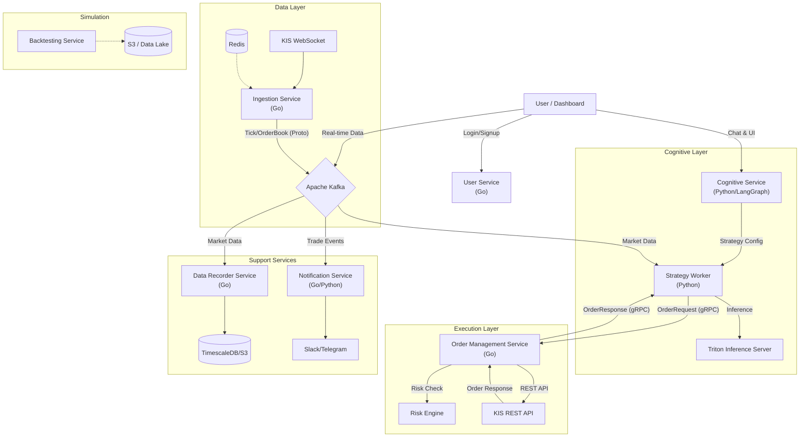

# 시스템 아키텍처

## 개요
이 프로젝트는 "에이전트 기반 AI 투자 성향 분석 및 고빈도 자동매매 시스템"을 구현합니다. 이는 정성적 의도 파악(인지 레이어)과 정량적 고속 실행(실행 레이어)을 융합한 시스템입니다.

## 시스템 관계도 (System Relationship Diagram)

## 핵심 철학
1.  **관심사의 분리 (Separation of Concerns)**: "두뇌"(Python/AI)와 "근육"(Go/Execution)의 철저한 분리.
2.  **이벤트 기반 (Event-Driven)**: 모든 데이터는 Kafka를 통해 불변(Immutable) 이벤트로 흐름.
3.  **상태 중심 에이전트 오케스트레이션**: LangGraph를 사용하여 복원력 있는 순환적 에이전트 워크플로우 구축.

## 하이레벨 아키텍처 레이어 상세

### 1. 인지 레이어 (Cognitive Layer - Python)
사용자의 자연어 입력을 이해하고, 이를 실행 가능한 투자 전략으로 변환하는 **두뇌** 역할을 합니다.
-   **역할**: 사용자 의도 파악, 시장 상황 분석, 매매 전략 생성.
-   **기술 스택**: Python, LangGraph, LangChain, FastAPI.
-   **주요 기능**:
    -   **UserProfile Agent**: 대화를 통해 사용자의 리스크 성향, 자본금, 선호 섹터를 추출하여 정형화된 프로파일 생성.
    -   **Strategy Architect**: 프로파일을 바탕으로 구체적인 매매 로직(진입/청산 조건, 자금 관리 등)이 담긴 JSON 설정 파일 생성.
    -   **Supervisor Agent**: 시장 분석가, 퀀트, 리스크 관리자 등 전문 에이전트들의 작업 순서를 조율하고 최종 의사결정을 승인.

### 2. 데이터 인프라 (Data Infrastructure - Go & Kafka)
시장의 맥박(Tick)을 놓치지 않고 시스템 전체에 공급하는 **심장** 역할을 합니다.
-   **역할**: 실시간 시장 데이터를 초저지연, 고대역폭으로 수집 및 분배.
-   **기술 스택**: Go, Apache Kafka, Redis, Protobuf.
-   **주요 기능**:
    -   **Ingestion Service (Go)**: KIS 웹소켓과 지속적인 연결을 유지하며, 네트워크 불안정 시 자동 재연결 및 백프레셔(Backpressure) 제어.
    -   **Kafka**: 틱(Tick), 호가(OrderBook), 신호(Signal)를 토픽별로 파티셔닝하여 순서 보장 및 병렬 처리 지원.
    -   **Redis**: 액세스 토큰(Token) 관리 및 실시간 호가 스냅샷(Snapshot) 저장.

### 3. 실행 레이어 (Execution Layer - Go & gRPC)
전략의 판단을 실제 시장 주문으로 연결하는 빠르고 정확한 **근육** 역할을 합니다.
-   **역할**: 주문을 안전하고 신속하게 실행하며, 사고를 방지.
-   **기술 스택**: Go, gRPC.
-   **주요 기능**:
    -   **Order Management System (OMS)**: gRPC 스트리밍을 통해 전략 엔진으로부터 주문을 수신하고, KIS API 규격에 맞춰 변환 후 전송.
    -   **Risk Engine**: 주문 전송 전, '주문 금액 한도', '가격 괴리율' 등을 1ms 이내에 검사하여 팻 핑거(Fat Finger) 방지.
    -   **Rate Limiter**: KIS API의 초당 요청 제한(TPS)을 준수하기 위한 토큰 버킷 알고리즘 구현.

### 4. 지원 서비스 (Support Services - Go/Python)
시스템의 운영 안정성과 사용자 편의성을 지원하는 **신경망** 역할을 합니다.
-   **역할**: 사용자 관리, 알림 발송, 데이터 영구 저장.
-   **기술 스택**: Go, Python, PostgreSQL, TimescaleDB.
-   **주요 기능**:
    -   **User Service (Go)**: 회원가입, 로그인(JWT), API 키 관리 등 사용자 인증 및 권한 관리.
    -   **Notification Service (Go/Python)**: 체결 알림, 에러 경보 등을 Slack, Telegram 등으로 발송.
    -   **Data Recorder Service (Go)**: Kafka의 실시간 데이터를 TimescaleDB나 S3에 영구 저장하여 백테스팅 데이터 확보.

### 5. 시뮬레이션 엔진 (Simulation Engine - Python)
과거 데이터를 통해 전략의 유효성을 검증하는 **실험실** 역할을 합니다.
-   **역할**: 이벤트 기반 백테스팅을 통한 전략 검증.
-   **기술 스택**: Python, Pandas.
-   **주요 기능**:
    -   **Event-Driven Replay**: 과거 데이터를 시간 순서대로 하나씩 재생하여 실제 매매 환경 모사.
    -   **Reality Modeling**: 네트워크 지연 시간(Latency)과 슬리피지(Slippage)를 확률적으로 모델링하여 수익률 과대평가 방지.

### 6. MLOps 및 추론 (MLOps & Inference - Python/C++)
고도화된 AI 모델을 학습하고 서비스하는 **지식 저장소** 역할을 합니다.
-   **역할**: AI 모델 학습 및 실시간 서빙.
-   **기술 스택**: Amazon SageMaker, NVIDIA Triton Inference Server.
-   **주요 기능**:
    -   **Model Serving**: 학습된 PyTorch/TensorFlow 모델을 TensorRT로 최적화하여 초고속 추론 제공.
    -   **Dynamic Batching**: 다수의 추론 요청을 하나로 묶어 GPU 처리 효율 극대화.
